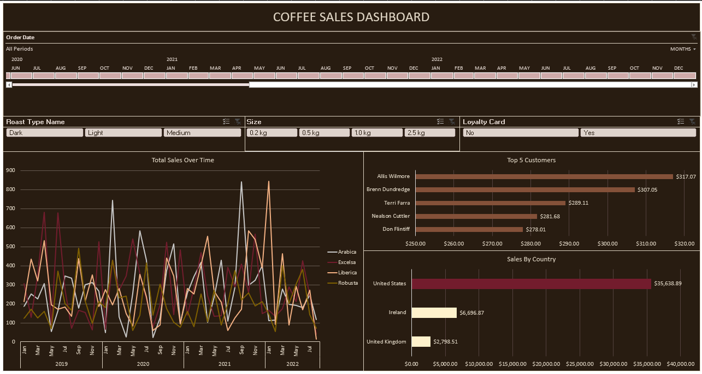

# Excel Coffee Orders Sales Analysis

## Overview
This project analyzes coffee order sales data to extract insights and visualize key metrics using Excel. The process includes data cleaning, advanced formulas, pivot tables, and dashboard creation.

---

## Key Steps

### 1. Data Preparation
- **Customer Information Retrieval:**
  - Used `XLOOKUP` to dynamically fetch **Customer Name**, **Email**, **Country**, and **Loyalty Card** from the `customers` sheet based on `Customer ID`.

- **Coffee Details Retrieval:**
  - Used `INDEX-MATCH` to fetch **Coffee Type**, **Roast Type**, **Size**, and **Unit Price** from the `products` sheet.

- **Abbreviation Expansion:**
  - Used nested `IF` formulas to convert coffee and roast type abbreviations into full names:
    - Example: `"Rob"` → `"Robusta"`, `"M"` → `"Medium"`.

- **Date and Size Formatting:**
  - Changed date format to `dd-mmm-yyyy`.
  - Added the "kg" metric to the **Size** column using custom formatting.

- **Data Deduplication:**
  - Checked for duplicates using the **Data** ribbon.

- **Table Conversion:**
  - Converted the data range into a table for structured analysis and named it **Orders**.

---

### 2. Sales Insights
- **Sales Calculations:**
  - Added a **Sales** column: `Quantity * Unit Price`.

- **Interactive Pivot Tables and Charts:**
  - **Total Sales Over Time:** Line chart created from a pivot table.
  - **Sales by Country:** Bar chart showing country-wise sales.
  - **Top 5 Customers:** Identified top customers by sales and visualized using a bar chart.

---

### 3. Dashboard Creation
- Combined all charts and pivot tables into a clean, interactive Excel dashboard, summarizing:
  - **Total Sales Over Time**
  - **Sales By Country**
  - **Top 5 Customers**
  - **Sales Metrics**

---

### 4. Dashboard

## Tools and Techniques
- **Functions Used:** `XLOOKUP`, `INDEX-MATCH`, `IF`
- **Excel Features:** Pivot Tables, Line Charts, Bar Charts, Custom Formatting
- **Interactive Dashboard**  

--- 